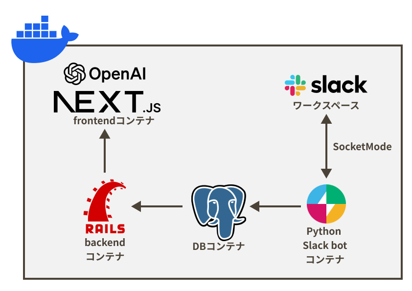

# Message-Log-Viewer

## 製品概要

> **チームビルディング ✖️　Tech**

### 背景(製品開発のきっかけ、課題等）

多くのエンジニアのチャットツールは **Slack** を使用しています．Slackの仕様上，90日を過ぎると過去のメッセージを閲覧できなくなります．世代交代の激しい学生の開発団体・組織では，1年前の情報を閲覧したいという課題がありました．そこで，Slackの履歴を保存して閲覧できるようにしようと開発を始めました．  
さらに，団体・組織では，チームビルディングが非常に重要となります．組織運営を行う上で，チャットツールでの，複数のプロジェクトの動きや，メンバーの様子を把握するのは難しいという課題があります．
そこで，保存したチャット履歴を使用して，組織のキーパーソンやメンバー間の結びつきを把握ができるのではないかと考えました．

### 製品説明（具体的な製品の説明）

### 特長

#### 1. メッセージの即時保存・閲覧

Slackのチャンネルにbotを導入することで，全ユーザが発言したメッセージ，画像，リンクを保存し，webページで閲覧できるようにすることで，過去のメッセージを遡れる機能です．
WebページのUIは既存のSlackになるべく近づけて，違和感を減らすよう設計しました．

#### 2. チャンネルのセパレートビュー

Webページで履歴を閲覧するときに，複数のチャンネルを同時に閲覧できるという機能を実装しました．

#### 3. ユーザのメッセージ履歴グラフ

gpt-3.5 API を使用し，ユーザが1週間以内に発言したメッセージから，要約を作成・表示できることで，チャットツール上で各ユーザの行動の概要を把握できます．

### 解決出来ること

- Slackのチャンネル別の履歴保存
- SlackライクなWebページでの履歴の閲覧
- ユーザのメッセージ履歴グラフ・概要表示によって，ユーザの活動状況の把握

### 今後の展望

- メッセージ・画像にタグ付けを行い，検索機能の強化
- ユーザ間の結びつきを可視化するネットワークグラフ機能の作成

### 注力したこと（こだわり等）

- SlackライクなUI・UX
- Slack-bot間の通信にSocketModeを使用
- gpt-3.5 apiを使用し，ユーザの行動概要を表示

## 開発技術

### 活用した技術

  

#### API・データ

- OpenAI API (gpt-3.5)

#### フレームワーク・ライブラリ・モジュール

- Next.js
- React
- Ruby on Rails
- postgreSQL
- slack-bolt
- Docker

#### デバイス

- Webブラウザ

### 独自技術

#### ハッカソンで開発した独自機能・技術

- [グラフモーダルにChatGPT-APIを実装する](https://github.com/jphacks/OL_2322/pull/6)  
gpt-3.5 apiを使用して，ユーザの行動の概要を表示しました．